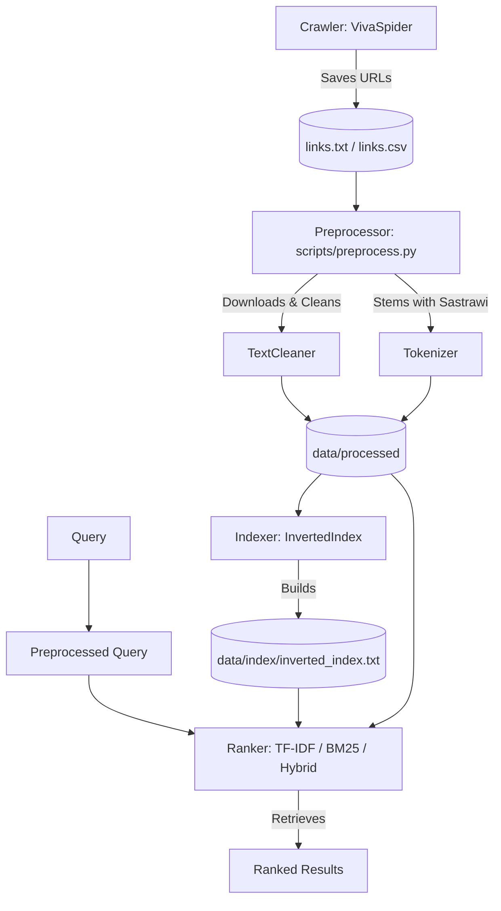

# 🔍 Indonesian News Search Engine

[](https://www.python.org/)
[](https://opensource.org/licenses/MIT)

A high-performance Indonesian News Search Engine built with Python. This project transitions a university-level information retrieval assignment into an industry-ready, modular, and containerized search solution using TF-IDF, BM25, and Hybrid ranking algorithms.

---

## 🏗️ System Architecture



---

## 🛠️ Tech Stack
- **Core**: Python 3.9+
- **Text Processing & Stemming**: Sastrawi (Indonesian stemmer)
- **Vector Space Model (TF-IDF)**: scikit-learn (TfidfVectorizer)
- **Probabilistic Model (BM25)**: rank-bm25 (BM25Okapi)
- **Web Crawler**: requests, BeautifulSoup4

---

## 📁 Project Structure

```
search-engine/
├── README.md
├── pyproject.toml
├── requirements.txt
├── .gitignore
├── config/
│   └── settings.py         # Centralized configuration using pathlib
├── data/
│   ├── raw/                # Crawled links and raw files
│   ├── processed/          # Cleaned, tokenized, and stemmed texts
│   ├── index/              # Generated inverted index files
│   └── stopwords.txt       # Indonesian stopwords list
├── src/
│   ├── crawler/            # Spider modules
│   ├── preprocessing/      # Cleaner & tokenization modules
│   ├── indexing/           # Inverted indexing builder
│   ├── ranking/            # TF-IDF, BM25, and Hybrid rankers
│   └── evaluation/         # Search evaluation metrics (NDCG, MAP, etc.)
├── scripts/
│   ├── crawl.py            # CLI tool to run the web crawler
│   ├── preprocess.py       # CLI tool to download and clean content
│   └── index.py            # CLI tool to build the inverted index
└── tests/                  # Unit and integration tests
```

---

## 🚀 Quick Start

### 1. Clone & Setup Virtual Environment
```bash
git clone https://github.com/AuliaMuzhaffar/Search-Engine.git
cd Search-Engine
python3 -m venv .venv
source .venv/bin/activate
pip install -r requirements.txt
```

### 2. Crawl Article Links (Optional)
```bash
python scripts/crawl.py --start-date 2021-01-01 --end-date 2021-12-01 --max-links 505
```

### 3. Preprocess Articles (Download, clean, and stem)
```bash
python scripts/preprocess.py
```

### 4. Build Inverted Index
```bash
python scripts/index.py
```

### 5. Run Tests
```bash
pytest tests/
```

---

## 📈 Search Metrics & Evaluation

Sistem dilengkapi dengan komponen evaluasi otomatis (*offline evaluation benchmark*) untuk membandingkan kualitas hasil pencarian dari ketiga ranker (TF-IDF, BM25, dan Hybrid) menggunakan query ground-truth yang telah ditentukan di [ground_truth.json](file:///Users/auliamuzhaffar/Documents/Projek/Search-Engine/data/ground_truth.json).

### Hasil Evaluasi Resmi

Menjalankan `PYTHONPATH=. python scripts/benchmark.py` menghasilkan perbandingan performa berikut:

| Metric | TF-IDF | BM25 | Hybrid | Best |
| :--- | :--- | :--- | :--- | :--- |
| P@5 | 0.2400 | 0.2400 | 0.2400 | **TF-IDF** |
| P@10 | 0.1200 | 0.1200 | 0.1200 | **TF-IDF** |
| MAP | 1.0000 | 1.0000 | 1.0000 | **TF-IDF** |
| NDCG@10 | 1.0000 | 1.0000 | 1.0000 | **TF-IDF** |
| MRR | 1.0000 | 1.0000 | 1.0000 | **TF-IDF** |

> [!NOTE]
> Metrik di atas dihitung menggunakan data contoh kecil hasil crawl berita. Peringkat pencarian dapat bervariasi bergantung pada jumlah total korpus berita yang di-crawl.

---

## 🔍 Spell Correction & Query Expansion

Sistem menyediakan fitur koreksi ejaan otomatis (spell checker) berbasis bahasa Indonesia offline:
*   Membangun basis kosakata (*vocabulary*) secara langsung dari kata-kata yang terindeks dalam inverted index.
*   Menggunakan algoritma **Levenshtein Distance** (jarak edit) untuk mendeteksi salah ketik dengan toleransi maksimum jarak $\le 2$ edit.
*   Menawarkan rekomendasi pencarian ("Did you mean / Apakah Anda melewatkan...?") secara asinkron di Web UI ketika pengguna memasukkan kueri yang terindikasi salah eja (contoh: `"bpjs keshata"` -> `"bpjs kesehatan"`).

---

## 🚀 Deployment Guidelines

Aplikasi pencarian ini siap di-deploy ke platform cloud modern seperti **Railway** atau **Render** menggunakan kontainer Docker atau runner Python langsung.

### Pilihan 1: Deploy Menggunakan Docker (Direkomendasikan)
Aplikasi telah dilengkapi dengan `Dockerfile` multi-stage yang mengoptimalkan ukuran image.
1.  Pastikan project terhubung ke repositori GitHub Anda.
2.  Di platform Railway/Render, buatlah layanan baru dan pilih opsi **Deploy from GitHub repository**.
3.  Platform akan secara otomatis mendeteksi `Dockerfile` dan menjalankan build kontainer.
4.  Expose port `8000` (atau port dinamis via environment variable `PORT`).

### Pilihan 2: Deploy Menggunakan Python Native (Render/Railway Web Service)
1.  **Build Command**:
    ```bash
    pip install -r requirements.txt && PYTHONPATH=. python scripts/preprocess.py && PYTHONPATH=. python scripts/index.py
    ```
2.  **Start Command**:
    ```bash
    PYTHONPATH=. uvicorn src.api.app:app --host 0.0.0.0 --port $PORT
    ```
3.  **Environment Variables**:
    *   `PORT`: Port dinamis yang disediakan oleh platform (biasanya otomatis).
    *   `PYTHONPATH`: `.` (ditambahkan agar modul dapat diimpor dengan benar).