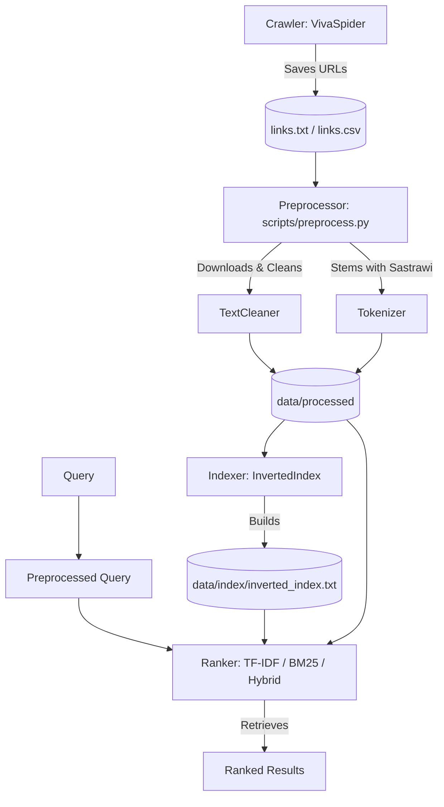

# 🔍 Indonesian News Search Engine

[](https://www.python.org/)
[](https://opensource.org/licenses/MIT)

A high-performance Indonesian News Search Engine built with Python. This project transitions a university-level information retrieval assignment into an industry-ready, modular, and containerized search solution using TF-IDF, BM25, and Hybrid ranking algorithms.

---

## 🏗️ System Architecture



---

## 🛠️ Tech Stack
- **Core**: Python 3.9+
- **Text Processing & Stemming**: Sastrawi (Indonesian stemmer)
- **Vector Space Model (TF-IDF)**: scikit-learn (TfidfVectorizer)
- **Probabilistic Model (BM25)**: rank-bm25 (BM25Okapi)
- **Web Crawler**: requests, BeautifulSoup4

---

## 📁 Project Structure

```
search-engine/
├── README.md
├── pyproject.toml
├── requirements.txt
├── .gitignore
├── config/
│   └── settings.py         # Centralized configuration using pathlib
├── data/
│   ├── raw/                # Crawled links and raw files
│   ├── processed/          # Cleaned, tokenized, and stemmed texts
│   ├── index/              # Generated inverted index files
│   └── stopwords.txt       # Indonesian stopwords list
├── src/
│   ├── crawler/            # Spider modules
│   ├── preprocessing/      # Cleaner & tokenization modules
│   ├── indexing/           # Inverted indexing builder
│   ├── ranking/            # TF-IDF, BM25, and Hybrid rankers
│   └── evaluation/         # Search evaluation metrics (NDCG, MAP, etc.)
├── scripts/
│   ├── crawl.py            # CLI tool to run the web crawler
│   ├── preprocess.py       # CLI tool to download and clean content
│   └── index.py            # CLI tool to build the inverted index
└── tests/                  # Unit and integration tests
```

---

## 🚀 Quick Start

### 1. Clone & Setup Virtual Environment
```bash
git clone https://github.com/AuliaMuzhaffar/Search-Engine.git
cd Search-Engine
python3 -m venv .venv
source .venv/bin/activate
pip install -r requirements.txt
```

### 2. Crawl Article Links (Optional)
```bash
python scripts/crawl.py --start-date 2021-01-01 --end-date 2021-12-01 --max-links 505
```

### 3. Preprocess Articles (Download, clean, and stem)
```bash
python scripts/preprocess.py
```

### 4. Build Inverted Index
```bash
python scripts/index.py
```

### 5. Run Tests
```bash
pytest tests/
```

---

## 📈 Search Metrics & Evaluation
This search engine supports standard evaluation metrics including:
- **Precision@K & Recall@K**
- **MAP (Mean Average Precision)**
- **NDCG@K (Normalized Discounted Cumulative Gain)**
- **MRR (Mean Reciprocal Rank)**

Metrics are safely implemented with division-by-zero guards and conform to NumPy 2.0 compatibility standards.